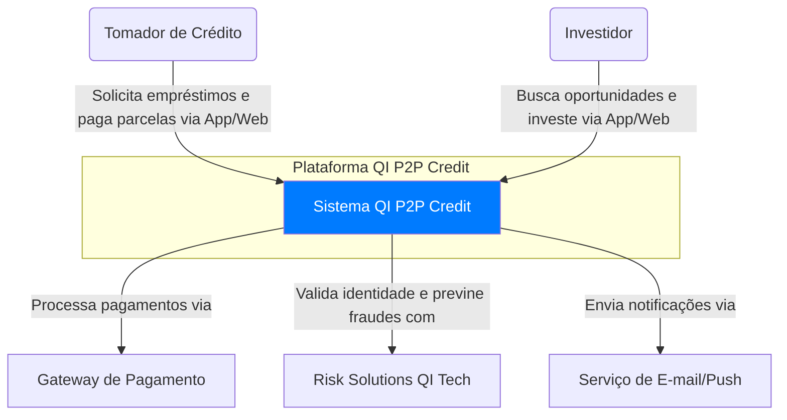

# Arquitetura Geral

Utilizamos o **Modelo C4** para descrever a arquitetura em diferentes níveis de abstração, garantindo clareza para todos os públicos.

## Nível 1: Diagrama de Contexto

O diagrama de contexto mostra como nossa plataforma se encaixa no mundo.



## Nível 2: Diagrama de Contêineres

Este diagrama decompõe o sistema em seus principais "contêineres" (aplicações, bancos de dados).

```mermaid
graph TD
    subgraph "Internet"
        B(Tomador/Investidor)
    end

    subgraph "Plataforma QI P2P Credit (Nuvem)"
        C[Aplicação Web/Mobile App] -- "Faz chamadas HTTPS/JSON para" --> D[API Gateway];
        D -- "Roteia para" --> E[Microsserviço de Contas];
        D -- "Roteia para" --> F[Microsserviço de Empréstimos];
        D -- "Roteia para" --> G[Microsserviço de IA (Score)];
        
        E -- "Lê/Escreve em" --> H[(Banco de Dados Relacional)];
        F -- "Lê/Escreve em" --> H;
        F -- "Registra transações na" --> I[(Rede Blockchain)];
        G -- "Usa dados de" --> H;
    end

    B -- "Acessa" --> C;

    style C fill:#9d4edd
    style D fill:#5a189a
    style E fill:#c77dff
    style F fill:#c77dff
    style G fill:#c77dff
    style H fill:#f2e6ff
    style I fill:#f2e6ff
```

## Justificativa da Arquitetura

A escolha por uma arquitetura de microsserviços desacoplada por um API Gateway nos permite:
-   **Desenvolvimento Paralelo:** Times diferentes podem trabalhar em serviços diferentes.
-   **Escalabilidade Granular:** Podemos escalar apenas o serviço de "Empréstimos" em um dia de alta demanda, sem mexer nos outros.
-   **Resiliência:** Uma falha no serviço de "Notificações" não derruba o sistema inteiro.
-   **Alinhamento com a Cultura QI Tech:** Modularidade e simplicidade em cada serviço, seguindo a mesma arquitetura base.
