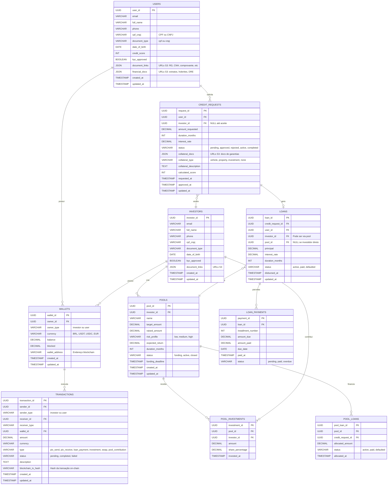

# Banco de Dados, Backend e Blockchain 

## Banco de Dados

Estrutura otimizada para transações financeiras P2P com suporte a escalabilidade e auditoria completa. Utiliza índices compostos em campos de consulta frequente e triggers para auditoria de saldos.

### Diagrama de Entidade-Relacionamento (DER)



### Descrição das Entidades Principais

**USERS** - Tomadores de crédito (pessoa física ou jurídica)
- `cpf_cnpj`: Suporta CPF (11 dígitos) ou CNPJ (14 dígitos)
- `document_type`: Define se é "cpf" ou "cnpj"
- `document_links`: Array JSON com URLs S3 dos documentos de identidade (RG, CNH, Contrato Social, etc.)
- `financial_docs`: Array JSON com URLs S3 dos documentos financeiros (extratos bancários, holerites, DRE, balanços, etc.)

**CREDIT_REQUESTS** - Solicitações de crédito
- Armazena dados da requisição incluindo documentos de garantias (`collateral_docs`)
- `investor_id` é NULL até que um investidor aceite a concessão
- Cada usuário pode ter múltiplas requisições ao longo do tempo
- `calculated_score`: Score de risco calculado pela IA no momento da requisição

**POOL_INVESTMENTS** - Tabela associativa entre investidores e pools
- Registra quanto cada investidor aportou em cada pool
- Calcula participação percentual de cada investidor no pool

**POOL_LOANS** - Tabela associativa entre pools e empréstimos
- Define quais créditos foram financiados por quais pools
- Permite rastreabilidade de onde veio o capital de cada empréstimo

---

## API Backend

### Endpoints Principais por Feature

#### Autenticação & Onboarding
```
POST   /auth/register
POST   /auth/login
POST   /auth/verify-otp
POST   /kyc/facial-verification
POST   /kyc/documents
GET    /kyc/status
```

#### Crédito (Borrowers)
```
POST   /credit/request              # Solicitar crédito com docs de garantia
GET    /credit/requests             # Listar minhas requisições
GET    /credit/requests/{id}        # Detalhes da requisição
GET    /loans/active                # Empréstimos ativos
POST   /loans/{id}/payments         # Pagar parcela
GET    /loans/{id}/schedule         # Ver cronograma
```

#### Investimentos (Lenders)
```
GET    /credit-requests/marketplace # Requisições disponíveis para investir
POST   /credit-requests/{id}/accept # Aceitar e conceder crédito
GET    /portfolio/overview          # Visão geral do portfólio
GET    /portfolio/performance       # Analytics de rentabilidade
```

#### Pools
```
POST   /pools                       # Criar pool de investimento
POST   /pools/{id}/invest           # Investir em pool
GET    /pools                       # Listar pools disponíveis
GET    /pools/{id}/performance      # Performance do pool
```

#### Carteiras & Transações
```
GET    /wallet/balances             # Saldos multi-moeda
POST   /currencies/swap             # Executar swap (cripto ↔ fiat)
GET    /currencies/rates            # Cotações em tempo real
POST   /pix/send                    # Enviar PIX
POST   /pix/receive/generate-qr     # Gerar QR Code PIX
GET    /transactions                # Histórico de transações
```

#### Depósitos
```
GET    /deposits/methods            # Métodos disponíveis (PIX, TED, Open Finance)
POST   /open-finance/auth/initiate  # Iniciar autenticação bancária
POST   /deposits/execute            # Executar depósito
```

**Nota:** Endpoints auxiliares de notificações, perfil, segurança e configurações existem no MVP mas foram omitidos para brevidade.

---

## Blockchain & Smart Contracts

### Arquitetura Blockchain

**PoC (Hackathon):**
- **Rede:** Solana Devnet
- **Linguagem:** Rust (Solana Programs)
- **Propósito:** Registro de garantias e histórico de transações
- **Custos:** Zero gas fees (testnet)

**MVP (Produção):**
- **Rede:** Polygon PoS (primário) + Ethereum Mainnet (alta valor)
- **Linguagem:** Solidity (compatibilidade EVM)
- **Infraestrutura:** Nós via Alchemy/Infura com fallback

### Funcionalidades On-Chain

**Registro de Garantias:**
```solidity
struct Collateral {
    address borrower;
    string collateralType;      // "vehicle", "property", "investment"
    string documentHash;         // Hash IPFS dos documentos
    uint256 estimatedValue;
    uint256 timestamp;
    bool verified;               // Validado por IA
}
```

**Smart Contract de Empréstimo:**
```solidity
struct Loan {
    address borrower;
    address lender;              // Pode ser pool contract
    uint256 principal;
    uint256 interestRate;
    uint256 durationMonths;
    uint256 disbursedAt;
    LoanStatus status;           // Active, Paid, Defaulted
}
```

**Pool de Investimentos:**
```solidity
struct Pool {
    address creator;
    uint256 targetAmount;
    uint256 raisedAmount;
    mapping(address => uint256) investments;
    LoanContract[] loans;
}
```

### Integrações Blockchain

**Swap de Moedas:**
- Integração com DEXs (Uniswap, PancakeSwap) para conversão automática
- Uso de oráculos (Chainlink) para cotações confiáveis em tempo real

**Liquidação de Pagamentos:**
- Smart contracts executam distribuição automática dos pagamentos de parcelas
- Investidores recebem proporcionalmente à sua participação nos pools

**Auditoria Imutável:**
- Todo crédito concedido gera um NFT de "contrato de empréstimo"
- Histórico completo de pagamentos registrado on-chain para transparência

---

## Estratégias de Escalabilidade

### Banco de Dados
- **Particionamento:** Considerar sharding por `user_id` hash para distribuir carga em produção
- **Read Replicas:** PostgreSQL Aurora com 2-3 réplicas de leitura para queries analíticas
- **Índices Otimizados:**
  ```sql
  CREATE INDEX idx_loans_status_user ON loans(user_id, status);
  CREATE INDEX idx_transactions_wallet_date ON transactions(wallet_id, created_at DESC);
  CREATE INDEX idx_credit_requests_status ON credit_requests(status, requested_at);
  ```

### API
- **Rate Limiting:** 100 req/min por usuário (implementação em memória na PoC, Redis no MVP)
- **Caching:** Cache de 5min para cotações, 1h para dados de perfil (em memória na PoC)
- **Auto-scaling:** Horizontal scaling baseado em CPU > 70% (apenas MVP)

### Blockchain
- **Batch Processing:** Agrupar transações menores em batches para reduzir gas fees
- **Layer 2:** Considerar Polygon zkEVM ou Optimism para escala adicional no MVP
- **Fallback:** Sistema funciona offline se blockchain estiver indisponível (sync posterior)

---

## Considerações de Segurança

**PoC:** Foco em funcionalidade e demonstração. Validações básicas de input, HTTPS via load balancer, e autenticação JWT simples.

**MVP:** Implementação completa de criptografia (AES-256 para dados sensíveis), TLS 1.3, HSM para chaves blockchain, detecção de fraude via ML, e conformidade com LGPD (anonimização, direito ao esquecimento, auditoria imutável por 7 anos).