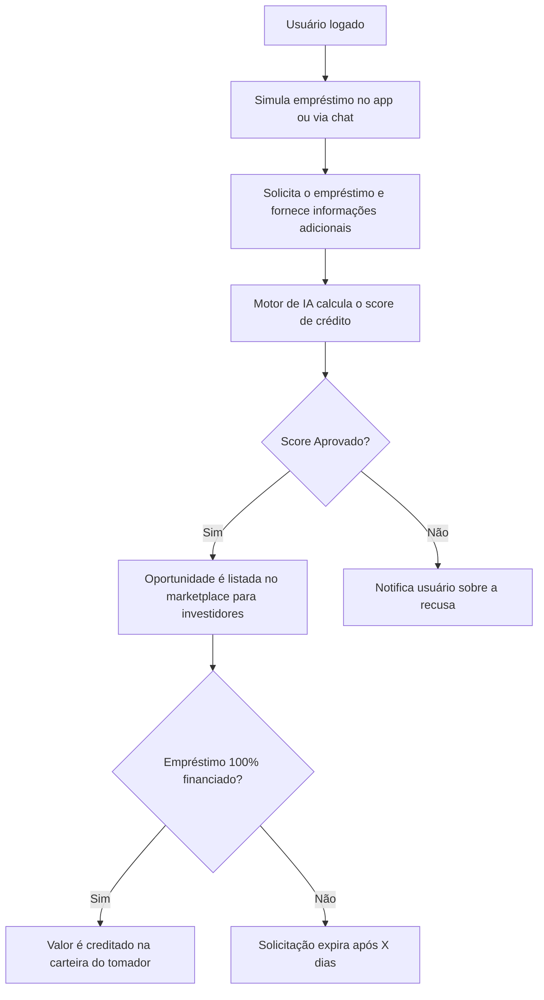
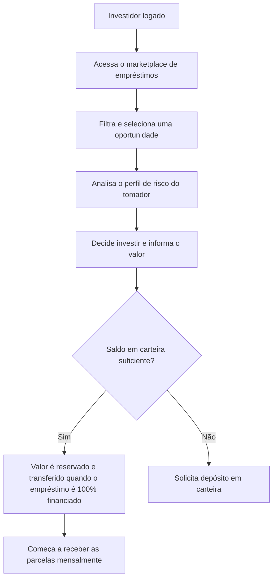

# Jornada do Usuário

Ilustramos abaixo os fluxos de interação dos principais atores com a plataforma.

## 1. Fluxo de Onboarding (Cadastro)

Este fluxo descreve como um novo usuário se cadastra e tem sua identidade validada.

```mermaid
graph TD
    A[Acessa a plataforma] --> B{Já possui conta?};
    B -- Não --> C[Preenche formulário de cadastro];
    C --> D[Envia documentos para verificação (KYC)];
    D --> E[Sistema de Antifraude analisa os dados];
    E --> F{Verificação Aprovada?};
    F -- Sim --> G[Conta criada e carteira ativada];
    F -- Não --> H[Notifica usuário sobre o problema];
    B -- Sim --> I[Faz login];
```

## 2. Fluxo de Solicitação de Empréstimo (Tomador)

Este fluxo mostra a jornada de um usuário que precisa de crédito.



## 3. Fluxo de Investimento (Investidor)

Este fluxo descreve como um investidor aloca seu capital.

